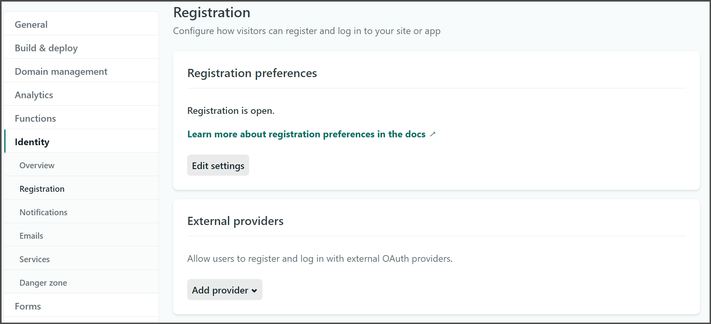
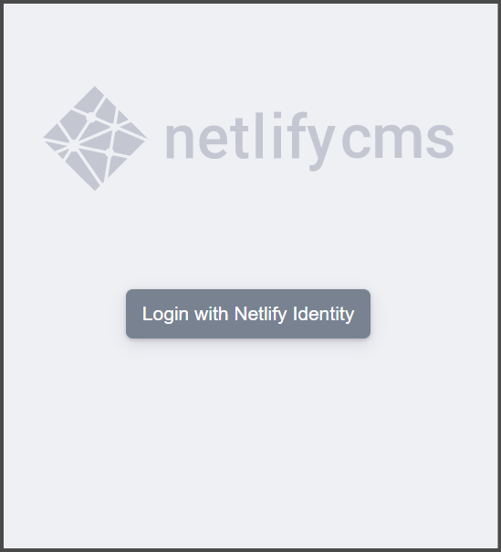
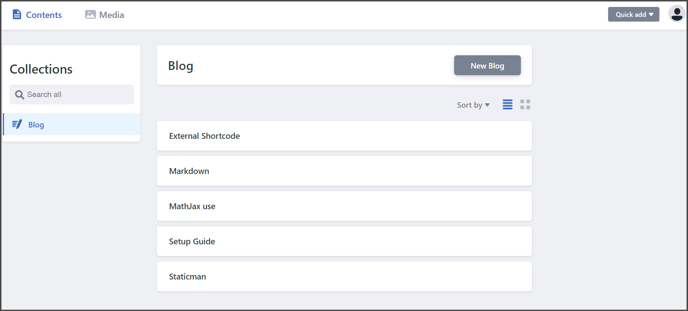
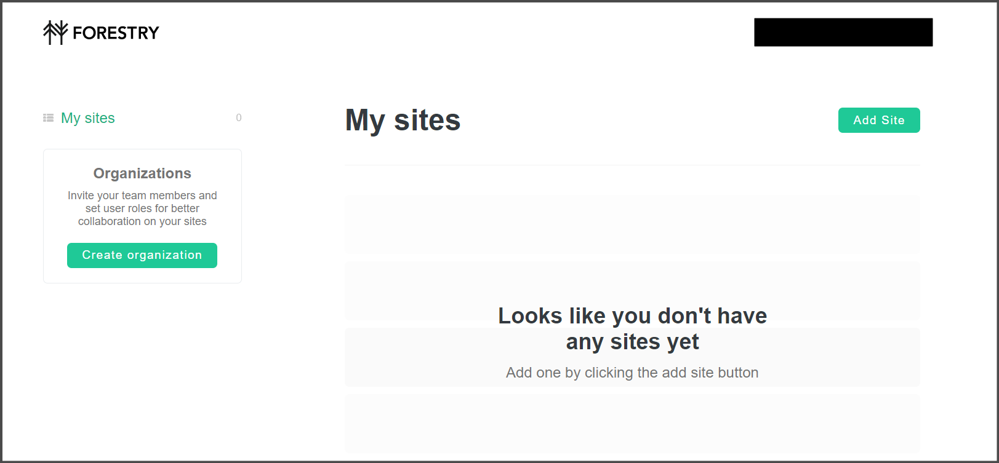
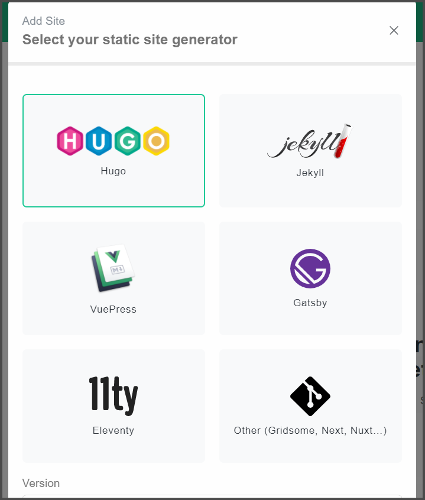
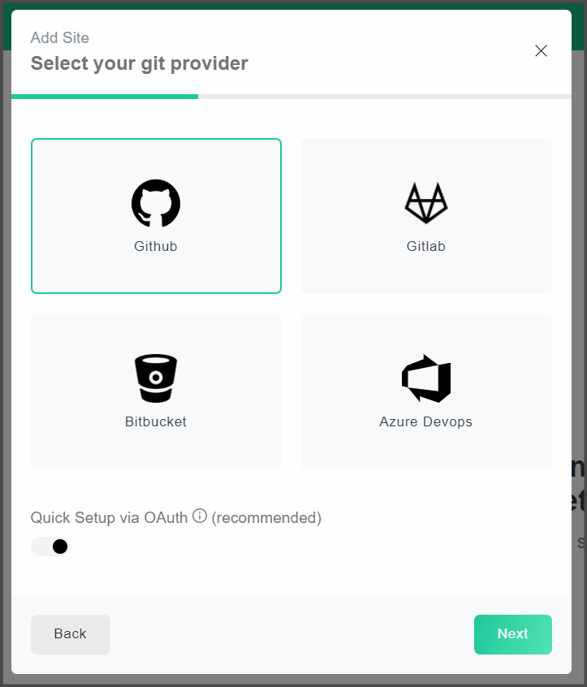

Tutorial on how to setup your blog to use this theme

<!--more-->

## Netlify

### Initial setup

You can deploy a blog automatically by using the automatic setup by [clicking here.](https://app.netlify.com/start/deploy?repository=https://github.com/IcpMoles/pyxback&stack=hugo)

Once signed up or logged in Netlify, linked your GitHub or GitLab account, you're going to be asked a name for the repository where Netlify will save your configuration files and all the posts' archive. Choose a name and keep in mind that this repository can be hidden later on.

Congrats, your blog is up and running.

### Setting up NetlifyCMS

Now head over to your Site Settings -> Identity and enable the Identiy manager.

Now go to  Site Settings -> Identity -> Services and enable the Git Gateway.

Now go to  Site Settings -> Identity -> Registration and in the Registration Preferences set to Invite Only.


Double check this step, otherwise everyone could be able to enter the CMS and edit your blog.

I don't know why Netlify set the default permission to open to everyone but I hope they will change this in the future.


Now go to  Site Settings -> Identity -> Emails and change all Path to template of the various subsections to `/netlify`.

Now you can invite users (and yourself) to edit your website by using their emails by going to Identity and clicking Invite Users.

You can enable other service providers too in Site Settings -> Identity -> Registration  -> External Providers and by adding them using the default configuration.

Now go to  Site Settings -> Identity -> General -> Site Details and you can change the random string assigned by Netlify to a more human friendly name for your website that you would like to see as your main url.

Now you can edit your blog content by heading to: `<yoursite>.netlify.com/netlify`

Once logged in you can use the CMS to manage your blog.

## Forestry

Head over to [Forestry](https://forestry.io/) and signup/login with your favorite method.

In the dashboard press Add Site. Select Hugo as your static site generator.

Then Github as your git provider.

Then after being logged in select the repository you made at the initial steps of Netlify and the main branch.

Now head over to Settings -> General -> Url and copy your website URL from Netlify.

In the same page, in the Project Paths section set Admin Path as `/static/admin` an press Deploy Admin.

Now you can access Forestry by going to `<yoursite>.netlify.com/admin`